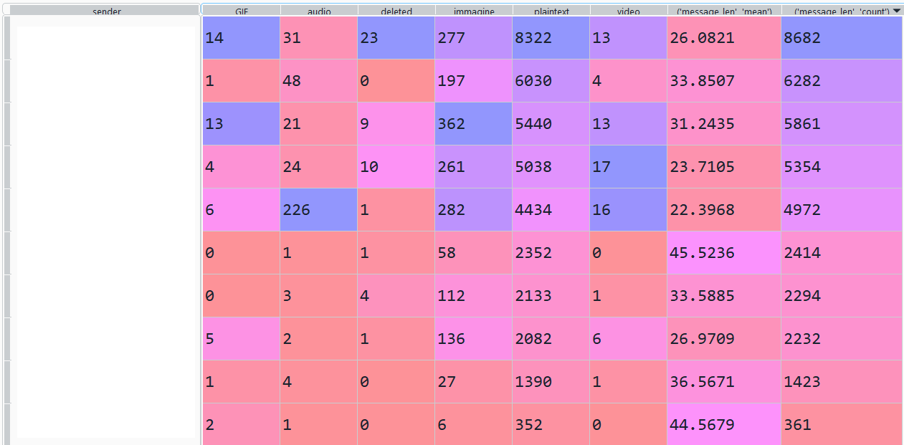
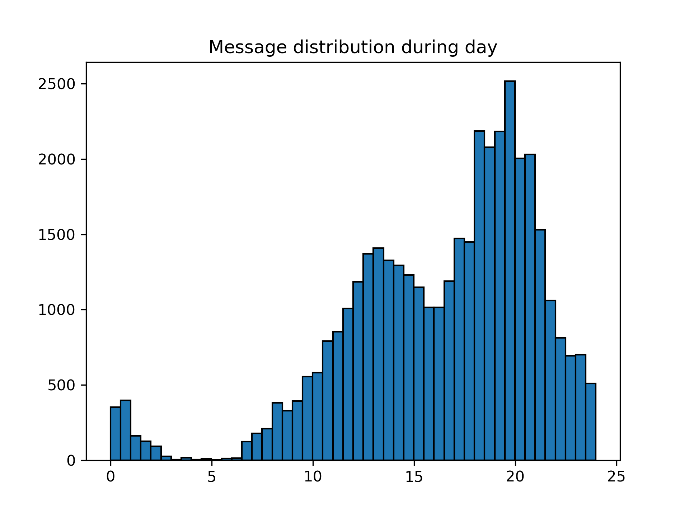
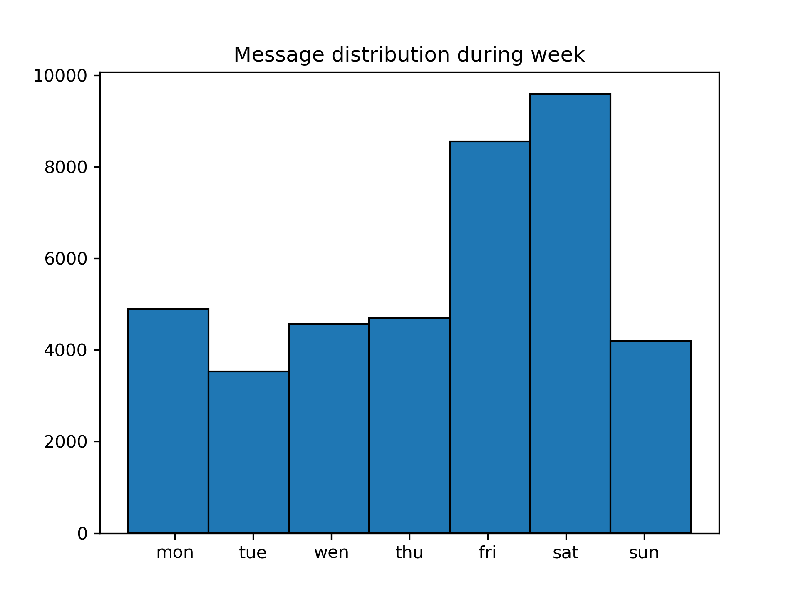
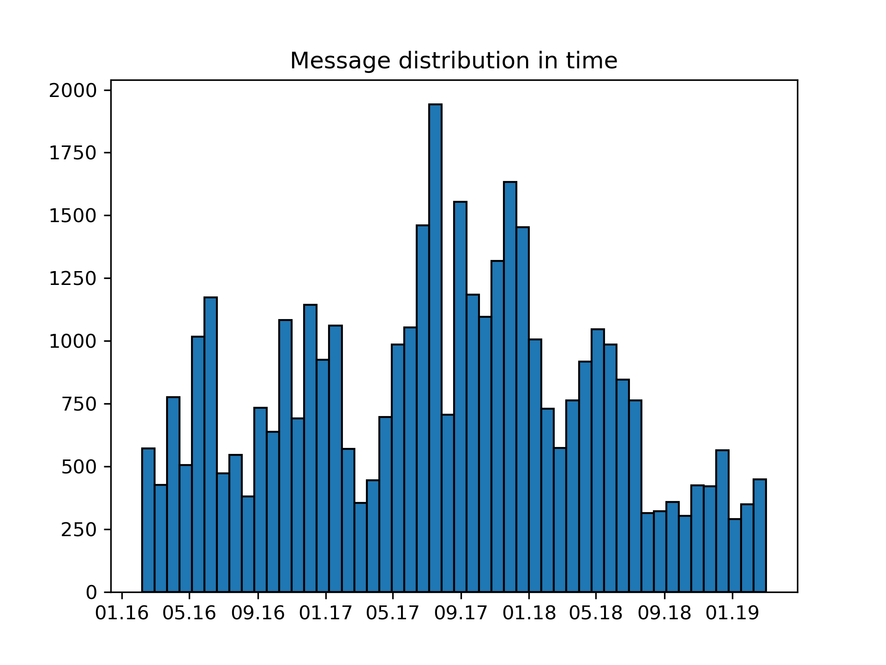
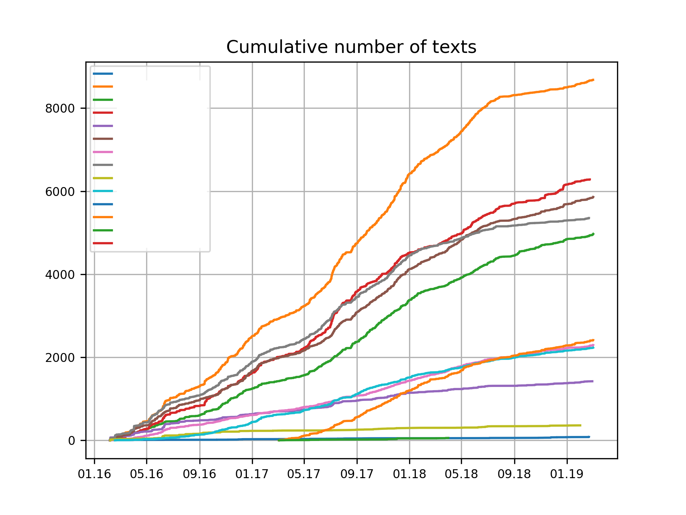
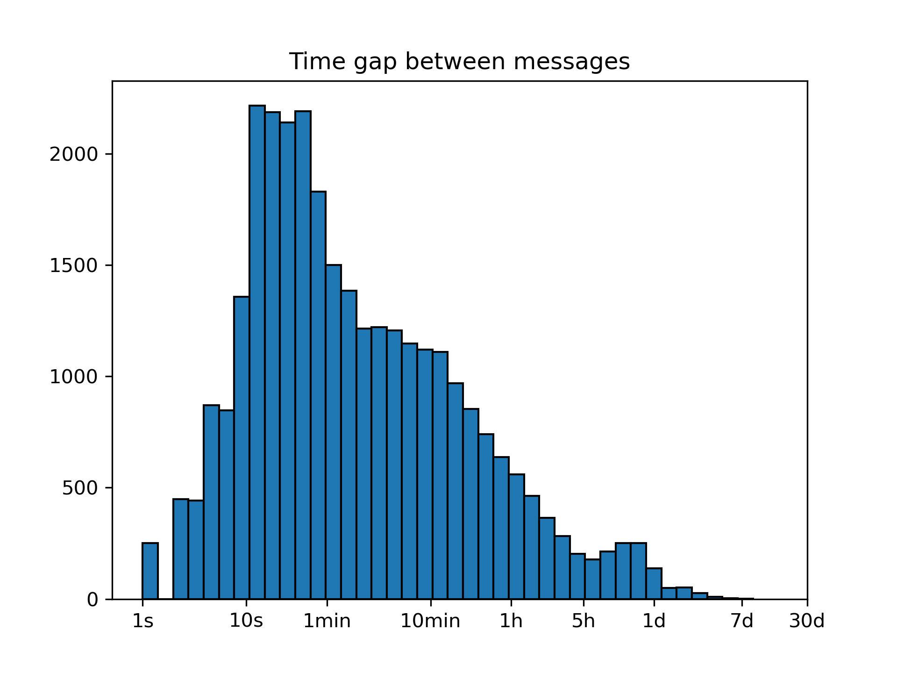
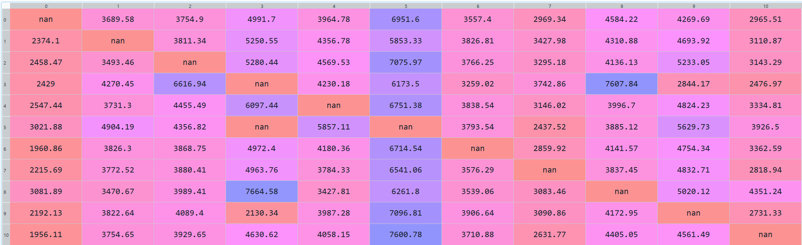
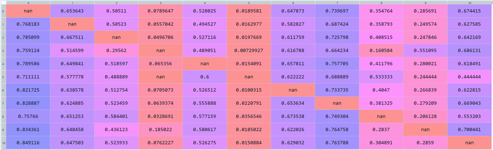

# A Whatsapp chat analyser
I have written this tool to extract analytics from the whatsapp chat exports in 2018.
The code for now is "as-it-was", when I first coded it, with minimal changes to make it run.
In `config.json` you set the regular expression used for parsing the chat, they are different for iPhone or Android phones.

## Some examples of what it can do
1. Some basic statistics, like how many message a user has sent, and of what type

2. Message distribution in time

3. Cumulative number of messages

4. Distribution of gap between messages

5. User answer time and answer rate (for each couple)

